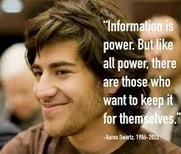

### PARTE SECONDA

Testimonianze e ricordi

Raccolta di post, articoli e interventi pubblici da parte di amici e
attivisti, nei giorni successivi alla morte di Aaron, ripresi da vari blog e
pagine online.

* * * * *

#### Aaron non era un hacker, ma un costruttore

Dal blog di David Weinberger, 13/01/2013. Post originale: [Aaron
Swartz](http://www.hyperorg.com/blogger/2013/01/13/aaron-swartz-was-not-a
-hacker-he-was-a-builder/) [was not a hacker. He was a
builder.](http://www.hyperorg.com/blogger/2013/01/13/aaron-swartz-was-not-a
-hacker-he-was-a-builder/) Traduzione di Silvia Franchini.

Di certo Aaron era un hacker leggendario e prodigioso nel senso di qualcuno
capace di costruire qualsiasi cosa partendo da qualsiasi cosa. Ma non è questo
che intendono i media quando lo definiscono “hacker”. Si riferiscono piuttosto
al fatto che avesse scaricato milioni di articoli [accademici da
JSTOR,](http://www.jstor.org/) e probabilmente anche che avesse reso
disponibili milioni di pagine di documenti legali federali parte del [progetto
RECAP.](https://www.recapthelaw.org/)

In nessuno di questi due casi si è trattato di “hacking” nel senso di forzare
illegalmente un sistema rimuovendone i lucchetti tecnologici. Limitare la
descrizione di Aaron – la sua vita così come sarà ricordata da quanti non
hanno avuto modo di conoscerlo – a quella di un “hacker” non è che una comoda
menzogna.

[Come ben chiarisce Alex Stamox](http://unhandled.com/2013/01/12/the-truth-
about-aaron-swartzs-crime/), non esistevano barriere tecnologiche , legali o
contrattuali per impedire ad Aaron di scaricare tutti gli articoli che volesse
da JSTOR, al di là dell’intrusione abusiva, ma anche questo è un fatto
discutibile (lo sgabuzzino del MIT che avrebbe forzato per avere un miglior
accesso alla rete interna in realtà era aperto). Scrive Alex:

«Aaron non operò un “hack” nel sito di JSTOR in nessuna delle accezioni del
termine “hack”. Aaron scrisse una manciata di script in Python che prima
individuarono gli indirizzi web degli articoli da scaricare e poi utilizzarono
CURL per scaricarli. Aaron non ricorse alla manomissione di parametri, non
infranse alcun CAPTCHA, non fece nulla di più complicato che scrivere un
semplice comando per scaricare i file, come quando facciamo clic sul tasto
destro del mouse scegliendo “Salva come” nella finestra del browser».

Ovviamente non era questo che JSTOR aveva in mente, ma era comunque qualcosa
che il suo contratto consentiva e che la sua tecnologia non impediva. Come ha
scritto ieri [Brewster Kahle:](http://blog.archive.org/2013/01/12/aaron-
swartz-hero-of-the-open-world-rip/)

«Quando ero al MIT, se qualcuno riusciva a scardinarne il sistema, magari
scaricando qualche database per giocarci un po’, poteva essere considerato un
eroe, prendeva una laurea e creava un’azienda. Invece contro di lui hanno
chiamato i poliziotti. La polizia. Il MIT ci proteggeva quando trasgredivamo
il sistema tradizionale».

Per quanto riguarda poi RECAP, i materiali resi disponibili da Aaron erano già
tutti di pubblico dominio.

Aaron non era un hacker, bensì qualcuno interessato a costruire.

Aaron ha contribuito alla messa a punto dello [standard
RSS](http://en.wikipedia.org/wiki/RSS) per consentire al flusso di
informazioni e idee online – ciò che definiamo genericamente “contenuti” – di
essere distribuite, intercettate e redistribuite
[[fonte](http://web.resource.org/rss/1.0/spec)].

Aaron ha creato l’architettura iniziale di CreativeCommons.org mettendo a
punto una licenza che rimuove gli attriti nel riutilizzo di materiale protetto
dal diritto d’autore [[fonte](http://creativecommons.org/weblog/entry/36298)].

Aaron ha ideato l’architettura iniziale della Open Library, un sistemadi
catalogazione libraria aperto al mondo
[[fonte].](http://blog.archive.org/2013/01/12/aaron-swartz-hero-of-the-open-
world-rip/)

Aaron ha svolto un ruolo importante nella crescita del movimento popolare che
ha bloccato il SOPA, normativa che avrebbe rafforzato il potere dell’alleanza
Hollywood-Washington, DC ai danni del web
[[fonte].](http://www.youtube.com/watch?v=Fgh2dFngFsg)

Aaron ha contribuito al successo di [Reddit](http://www.reddit.com/), sito
oggi centrale nel sistema di condivisione della Rete per milioni di noi.

Aaron ha contribuito alla realizzazione del
[Markdown](http://daringfireball.net/projects/markdown/), il modo più semplice
di scrivere pagine web in Html (lo uso per la maggior parte dei miei post)
[[fonte].](#LinkTarget_585)

Aaron ha creato Infogami, software che ha reso facile per gli utenti finali
creare siti web centrati sulla collaborazione e l’auto-espressione (poi
acquistato da Reddit).

Aaron ha scritto [web.py,](http://webpy.org/) da lui descritto come un
«software libero di applicazioni web per Python. Facilita lo sviluppo di
applicazioni web in Python gestendo in automatico molti dei passaggi relativi
al web. Reddit, per esempio, è stato costruito così». (In questa intervista
sentirete Aaron parlare anche del suo disgusto per il livello di misoginia del
mondo tecnologico) [[fonte].](http://www.reddit.com/r/reddit.com/comments/1oct
b/reddit_cofounder_aaron_swartz_discusses_how_he/)

Aaron ha fondato [Demand Progress](http://blog.demandprogress.org/) e ha
contribuito al lancio del  [Progressive Change
Campaign Committee](http://boldprogressives.org/), gruppi politici di base di
taglio pionieristico.

Le testate mainstream sanno che il loro pubblico di non addetti ai lavori
interpreterà il termine “hacker” nel [suo significato negativo e
distruttivo.](#LinkTarget_586) Dobbiamo impegnarci affinché ciò non accada,
non solo per il bene della memoria di Aaron ma per far sì che il suo impegno
venga celebrato, incoraggiato e portato avanti.

\*\*\*

#### Dare un senso alla perdita di Aaron

Testo originale: [Processing the loss of Aaron
Swartz](http://www.zephoria.org/thoughts/archives/2013/01/13/aaron-
swartz.html)*, **dal blog di danah boyd*, 13/01/2013. Traduzione di Cristian
Consonni.

Le ultime 24 ore sono state delle montagne russe a livello emotivo.
[Ieri](http://boingboing.net/2013/01/12/rip-aaron-swartz.html)
[mattina](http://boingboing.net/2013/01/12/rip-aaron-swartz.html) mi sono
svegliata e ho scoperto che un amico – Aaron Swartz – si era tolto la vita. Il
mio feed di Twitter si è riempito di espressioni di cordoglio, shock,
tristezza, rabbia, vendetta. Ho passato l’intera giornata a parlare con tanti
amici, tutti in varie fasi di smarrimento. Ne ho seguito gli [stati
d’animo](http://www.quinnnorton.com/said/?p=644) man mano che [ne
scrivevano](http://lessig.tumblr.com/post/40331489608/aaron-rip) [senza
filtri](http://www.oblomovka.com/wp/2013/01/12/he-was-funny/) sui [rispettivi
blog,](http://www.ethanzuckerman.com/blog/2013/01/12/goodbye-aaron/) pratica
che continuiamo a seguire da oltre un decennio.

Eppure non riuscivo ancora a trovare le parole per esprimere le mie
sensazioni. Quando ieri ho detto su Twitter che ero arrabbiata, qualche amico
ben intenzionato e degli psicologi che non conoscevano Aaron mi hanno scritto
che non potevo considerarmi responsabile della depressione di qualcun altro.
Mi è venuta voglia di urlare. Invece ho deciso di scrivere questo post. È
grezzo e imperfetto, ma descrive quello che sto provando ora.

Nel bene e nel male, nel corso degli anni ho conosciuto diverse persone che si
sono suicidate. Ne ho visti alcuni affetti da una depressione profonda che poi
hanno fatto quella scelta. Anch’io ho avuto a che fare con i miei demoni, per
cui hanno tutta la mia comprensione. Parte del motivo per cui la morte di
Aaron mi ha colpito come una sassata è che stavolta la situazione era diversa.

Credo indubbiamente che la depressione c’entri qualcosa. Adoravo Aaron perché
era un vortice di emozioni – un bastardo scontroso e un cervellone maniacale.
Le nostre conversazioni avevano un qualcosa di etereo e quando discutevamo mi
spingeva sempre a pensare ai problemi più complessi. Aveva una portata
intellettuale che mi lasciava sbalordita e la curiosità di un gattino. Quando
però si sentiva distruttivo, usava la sua acuta comprensione degli altri per
metterne a nudo i punti deboli e pungolarli dove faceva più male. Specialmente
con le persone che amava di più. Vedeva se stesso come un sociologo dilettante
perché innamorato dell'idea di capire come funziona la gente, e così ci
confrontavamo sul bisogno di rigore e di un’istruzione formale.

Conoscevo Aaron da nove anni, lo adoravo alla follia e al contempo lo trovavo
maledettamente frustrante. Negli ultimi anni i nostri contatti si erano fatti
più sporadici perché degli alti e bassi mi piacevano i momenti alti, ma facevo
veramente fatica con i bassi. Il suo arresto però mi aveva davvero
preoccupata. Decidemmo di non parlare mai del caso in sé, ma nel bel mezzo dei
nostri scambi d’idee scherzavamo, per sdrammatizzare la situazione, a
proposito del fatto che in carcere finalmente avrebbe prendere la laurea. Gli
promisi che avrei curato un piano formativo per lui, mettendo insieme le
migliori borse di studio, e che gli avrei mandato un articolo stampato da
JSTOR ogni giorno. Sapevo che la cosa gli pesava, ma sapevo anche che era un
attivista appassionato ed ero convinta che ce l'avrebbe fatta, che sarebbe
uscito da questo periodo buio.

Quello che mi ha fatto andare su tutte le furie ieri è stata la stessa cosa
che mi è rimasta sullo stomaco negli ultimi due anni. Quando il governo
federale ha deciso di incriminarlo – con il MIT rimasto vigliaccamente a
guardare – non è stato trattato come qualcuno che poteva avere fatto o meno
qualcosa di stupido. Era diventato un esempio. E il motivo per cui volevano
dargli una lezione non era perché volevano che la imparasse, bensì perché ne
avevano fatto una questione di principio, per dimostrare alla comunità hacker
di Cambridge che li tenevano in pugno [p0wned]. Era una minaccia che non aveva
nulla a che fare con la giustizia e tutto a che fare con la lotta per il
potere all’interno del sistema. Negli ultimi anni, gli hacker hanno sfidato lo
status quo e messo in discussione la legittimità di decine di decisioni
politiche. I loro mezzi possono essere criticabili, ma le intenzioni sono
state oneste. Il nocciolo di una democrazia che funziona è quello di mettere
sempre in discussione gli usi e gli abusi del potere in modo da prevenire
l'insorgere della tirannia. In anni recenti abbiamo visto hacker demonizzati
come anti-democratici pur se molti di loro si considerano come combattenti per
la libertà della nostra epoca. E le autorità hanno usato Aaron, dipingendo il
suo progetto sull'informazione libera come una storia di feroci hacker i cui
attacchi terroristi sono volti a distruggere la democrazia.

Le persone ragionevoli possono essere in disaccordo sulle tattiche e sul dove
e sul quando un particolare approccio supera la giusta misura. Al pari di
[Lessig, spesso anch’io ero in disaccordo](http://bit.ly/11qoCEu) con Aaron
rispetto alle sue specifiche strategie su come liberare l'informazione
mondiale, anche se non avrei mai dissentito sull’obiettivo finale. E una delle
ragioni per cui ieri così tanti hacker e geek hanno protestato contro il
sistema è dovuta al fatto che tanti pezzi grossi, persone preposte a questo
compito e nella posizione giusta per farlo, sono state incapaci di vedere
oltre i singoli atti di Aaron e di comprenderne le intenzioni e l'attivismo di
fondo. Così sono andate sprecate tante risorse pubbliche per controllare e
armonizzare la resistenza dei geek, per sopprimere ogni ribellione e punire
tutti coloro che sarebbero riusciti a beccare. Ma la maggior parte dei geek
opera nelle zone grigie, non è facile incastrarli e processarli per qualche
reato. È in questo contesto che la bravata di Aaron ha dato agli agenti
federali materiale sufficiente per portarlo davanti a un giudice e additarlo
come esempio. Hanno usato il loro potere per farlo tacere e condannarlo
pubblicamente prima ancora che iniziasse il processo.

Ieri si è parlato tantissimo del suo caso giudiziario, incluso un formidabile
[resoconto del perito a sua difesa. In molti si sono chiesti perché qualcuno
non](http://unhandled.com/2013/01/12/the-truth-about-aaron-swartzs-crime/) si
è fatto avanti prima. Posso spiegare solo il mio ragionamento. Ero troppo
spaventata per espormi pubblicamente nel timore che le mie parole avrebbero
potuto essere usate contro di lui. Ed ero troppo spaventata di rimanere
vittima della caccia alle streghe che ho visto concretizzarsi negli ultimi tre
anni. Perché tutto ciò non ha nulla a che fare con la giustizia o la sicurezza
nazionale. È legata al potere. Ed è questa, all'osso, la ragione per cui
l'amministrazione Obama per me è stata una cocente delusione. Nell'ultimo paio
d'anni ho discusso un numero ridicolo di volte con gente del governo su come
vengono trattati i geek e sulla loro incapacità di comprendere le motivazioni
le ragioni degli hacker, eppure non sono mai riuscita a capire come avrei
potuto cambiare le cose in tal senso. Questa cosa mi ha sempre causato una
grossa frustrazione, anche in quegli episodi, come la proteste contro il
SOPA/PIPA, in cui i geek hanno dimostrato di potersi imporre.

Così, eccoci qui oggi, con il mondo orfano del bambino prodigio capace
dimettere in mutande chiunque lo conoscesse. È diventato un giocattolo nello
spettacolo inscenato dal governo per dimostrare di essere potente. Lo hanno
perseguitato e intimidito, hanno giocato sulle sue debolezze per spezzarlo. E
ce l'hanno fatta. Tutto in nome della giustizia. Tutto ciò senza che fosse
nemmeno sottoposto a processo in una società che si fa orgogliodell'innocente
fino a prova contraria. È stata forse la depressione un fattore chiave di
quanto successo venerdì? Sicuramente. Ma non è tutta qui la storia. Ed è
questo che me la fa diventare difficile da digerire.

Gira molta e giustificabile indignazione là fuori. In molti vogliono la testa
dei funzionari che hanno contribuito a creare il contesto in cui Aaron si è
tolto la vita. Ne capisco perfettamente le motivazioni. Ma ho anche paura che
Aaron verrà trasformato in un martire, l'astrazione di un geek attivista
distrutto dallo Stato. Perché era molto più di questo – adorabile e
imperfetto, appassionato e determinato, brillante e stupido da far venir
rabbia. Sarà facile ritrovarsi a manifestare per piangere vendetta in suo
nome. Ma non se ne guadagna molto dal reificare il gioco del noi contro loro
che ci ha portati fin qui. Dev'esserci un’altra via d’uscita.

Quello che spero veramente venga fuori da quest’orribile tragedia è una seria
riflessione a livello di comunità e l’attenta verifica dei valori condivisi.
Molti dei punti chiave per cui si è battuto Aaron – la liberazione della
conoscenza, l'accesso aperto all'informazione e l'uso del codice per rendere
migliore il mondo – sono valori al cuore della comunità geek. Eppure, come ben
illustra Biella Coleman nel suo libro [Coding
Freedom](http://gabriellacoleman.org/Coleman-Coding-Freedom.pdf), questa
comunità non è certo priva di difetti. Lo stesso vale per Aaron. Ha fatto le
cose a modo suo perché era convinto che la passione, la volontà e l'azione
fossero più forti di qualsiasi cosa. E la sua testardaggine lo ha reso
vulnerabile. Se vogliamo raggiungere i valori e gli obiettivi che sono al
cuore della comunità geek, credo che non riusciremo mai a cambiare le cose
creando nuovi martiri che qualcuno può usare come esempi della guerra
culturale. Mentre [piangiamo
collettivamente](http://rememberaaronsw.tumblr.com/) la morte di Aaron e
canalizziamo la nostra rabbia per cercare di cambiare le cose, credo che
dovremmo cercare un approccio al cambiamento che non porti persone brillanti a
essere incastrate e tormentate dal potere in modo così esemplare.

\*\*\*

#### Perché Aaron è morto

Testo originale: [Why Aaron Died,](http://tarensk.tumblr.com/post/42260548767
/why-aaron-died:) dal blog di Taren Stinebrickner-Kauffman, 04/02/2013.
Traduzione di Eusebia Parrotto.

Qualche giorno fa mi sono svegliata e ho trovato Aaron lì con me. Era seduto
vicino al letto, sfoggiando il suo sorriso più sfacciato, e mi teneva la mano.

Per qualche minuto, ho assaporato una dolce incertezza: le ultime settimane
erano forse state tutto un incubo, e Aaron stava ancora con me? Oppure stavo
risvegliandomi da un sogno, e nel mondo reale Aaron era davvero morto?

Poi Aaron cercò di leggermi un libro, ma aveva problemi nel decifrare le
frasi. Disse che stava dimenticando come si legge per mancanza di pratica.
Divenne chiaro che si trattava di un sogno – il vero Aaron non avrebbe mai
dimenticato come si legge. E ciò significava che tutto quel che ricordavo sul
suo suicidio doveva essere vero nella vita reale.

Così gli ho chiesto perché. Perché l'hai fatto? Cosa ti è passato per la mente
quando ti sei ucciso? Avrei fatto qualunque cosa per te. Qualsiasi cosa, se
solo mi avessi detto di cosa avevi bisogno.

“Io sono un sogno,” rispose, dopo una lunga pausa. “Non è mio compito dirti
perché. Sono un sogno, non posso dirti nulla che non sai già”.

Avvolta dalla tristezza, mi costrinsi a svegliarmi dall'incubo che mi
avviluppava, solo per trovarmi di fronte all'incubo della vita reale. Non
avrei mai avuto le risposte che desideravo avere. Ma ho delle risposte che non
ha nessun altro. Ecco perché ho deciso di scrivere questo post.

Non credo che la morte di Aaron sia dovuta alla depressione.

Lo dico sapendo bene che molti altri non avrebbero compiuto la sua scelta in
quelle stesse condizioni sotto pressione.

Lo dico senza comunque voler sottovalutare il suo dolore – né peraltro la
sofferenza di chi è affetto da depressione.

Lo dico nonostante il fatto che all’inizio della nostra storia avevo letto e
discusso con lui di quello scellerato post sul suicidio scritto anni prima –
perciò non ero all'oscuro del fatto in passato aveva avuto dei problemi
mentali.

Lo dico perché negli ultimi 20 mesi della sua vita, Aaron ha trascorso più
tempo con me che con chiunque altro al mondo. Per gran parte degli ultimi 8
mesi della sua vita, abbiamo vissuto insieme, viaggiato tutti i giorni insieme
e lavorato nello stesso ufficio – e non ho mai temuto che fosse depresso fino
alle ultime 24 ore della sua vita.

Lo dico perché, dopo il suicidio, ho cercato di capire quel che è successo. Mi
sono informata. Ho fatto ricerche sulla depressione clinica e sui disturbi
connessi. Ne ho studiato i sintomi, e almeno fino alle ultime 24 ore della sua
vita, Aaron non ne soffriva.

Per questo è arduo leggere in tanti articoli che “Aaron lottava contro la
depressione” – come se il procedimento giudiziario fosse nient’altro che un
fattore fra i tanti, come se, forse, lui si sarebbe comunque suicidato l'11
gennaio, pur in assenza di alcun procedimento.

La depressione è caratterizzata da un calo di energia e da inattività,
abbandono e isolamento, scarsa autostima, problemi di concentrazione e
difficoltà a ricordare i dettagli, incapacità di provare piacere nella vita
quotidiana. Non tutte le persone depresse soffrono di problemi simili per
tutto il tempo, ma questi sono i segnali evidenti. E infatti, Aaron in quel
vecchio post sulla sua depressione aveva fatto riferimento a diversi sintomi
analoghi.

Ma lasciate che vi racconti dell'Aaron che ho conosciuto – l'Aaron Swartz del
2011, del 2012 e dei primi giorni del 2013.

L'Aaron che conoscevo io era un tipo energico. Aveva fatto parecchia attività
fisica per giorni fino a che non prese l'influenza, due settimane prima di
morire. Qualche settimana prima, quando ero fuori città per il weekend, mi
aveva sorpreso facendo un'escursione in montagna di un’interna giornata fuori
New York. Quella sera tornò raggiante, descrivendo come si era inerpicato su
una ripida roccia come “scorciatoia” sotto gli occhi di altri escursionisti (e
così aveva perso il Kindle giù per un dirupo).

L'Aaron che conoscevo io era socievole e felice di stare insieme alle persone
che amava, fino all'ultimo. Aveva progetti e ambizioni enormi. Il 9 gennaio,
due giorni prima di morire, passò delle ore immerso in una conversazione con
il nostro amico australiano Sam riguardo la nuova organizzazione che Aaron
aveva appena cominciato a costruire. Sam gli chiese se avesse dei sostenitori
e lui rispose che chiunque fosse abbastanza competente da potergli garantire
sostegno, nei fatti, fosse già un suo sostenitore – la classica arroganza
pessimista di Aaron, ma anche un richiamo al fatto di sapere che gli amici
erano con lui. Sam gli diede una veloce panoramica della politica australiana;
Aaron rimase sconcertato su quanto sarebbe stato facile “conquistare
l'Australia”, ma concluse che, per un Paese di appena 20 milioni di abitanti,
probabilmente non ne sarebbe valsa la pena.

L'autostima, inutile dirlo, non era certo un problema per Aaron.

L'Aaron che ho conosciuto non aveva problemi per concentrarsi o rammentare
certi dettagli. La settimana prima di morire stava divorando tutta la
letteratura scientifica che riusciva a trovare sulla dipendenza dalla droga e
su efficaci interventi di recupero. Non, per essere chiari, perché avesse
problemi di droga (non usava quasi mai neanche alcolici), bensì per un
progetto su cui stava lavorando per Givewell, l'organizzazione di beneficenza
da lui preferita. Mi riferiva con profondo godimento intellettuale le sue
conversazioni con i massimi esperti del settore, gli interventi che si erano
mostrati più promettenti per combattere l'alcolismo, le teorie che stava
elaborando sui cambiamenti politici concretamente realizzabili. Discutemmo dei
preconcetti culturali che permettono alla nostra società di considerare le
sostanze chimiche in modo diverso da come trattiamo la morfina e l'eroina.

L'Aaron che conoscevo io aveva profonde capacità di godere della vita
quotidiana. Aveva, naturalmente, problemi col cibo – nell'ambito dei normali
sintomi associati alla sua colite ulcerosa. Ma non esitava a esultare quando
trovava qualcosa di buono da mangiare – o qualsiasi cosa bella. Aveva un
raffinato senso estetico. Poteva trarre la più profonda, la più autentica
gioia per un muffin di mais perfetto, per un geniale costrutto narrativo
trovato nella biografia di Lyndon B. Johnson di Robert Caro, per un font
meraviglioso, più di chiunque altro abbia mai conosciuto.

E forse la cosa più incredibile è stata la sua capacità di mantenere tutte
queste qualità per quasi due anni, a fronte dell’inarrestabile incubo che ne
stava distruggendo la vita.

Aaron era umano: non era sempre felice, e sono la prima a dire che a volte
diventava davvero pesante vivere con lui. Poteva rivelarsi umorale e
introverso. Era spesso vittima di forti dolori per via dei problemi di
stomaco. Era esigente con se stesso (così come con gli altri). E naturalmente,
in fondo, era anche autodistruttivo.

Ma voglio ripeterlo ancora una volta: la morte di Aaron non è stata causata
dalla depressione. Questo è un punto importante, perché molti ritengono che
sia così, e che la risposta giusta alla sua morte è una cura migliore per la
depressione, una migliore capacità di percezione delle tendenze suicide.
Questo Paese ha assoluto bisogno di queste cose – Aaron sarebbe stato il primo
ad essere d'accordo – ma ne abbiamo bisogno perché questa è la cosa giusta da
fare, e non per quanto successo ad Aaron.

Non so spiegare con precisione perché Aaron si è ucciso. Non so dire
esattamente cosa gli passava per la testa. Se avessi saputo tutto ciò l'11
gennaio, o se avessi almeno saputo le giuste cose giuste da chiedergli, forse
sarei riuscita a fermarlo. Da quell'11 gennaio, ci ripenso a ogni ora del
giorno e della notte.

Come diceva però l’Aaron del sogno, posso solo sapere ciò che già so. E con la
conoscenza che ho – per averlo guardato, ascoltato, per le cose che gli ho
chiesto, accanto a lui, lì nel letto, mentre mangiavamo, parlando nella
metropolitana, dalle nostre scrivanie adiacenti nell'ufficio in cui lavoravamo
su vari progetti – dalle nostre vite insieme, penso che la morte di Aaron non
sia stata causata dalla depressione.

Credo che la morte di Aaron sia stata causata dall’esaurimento, dalla paura,
dall'insicurezza. Credo che la sua morte sia conseguenza diretta del
procedimento giudiziario che lo perseguitava già da due anni (dov’è andato a
finire il diritto costituzionale a processi rapidi?), e che ne aveva
prosciugato tutte le risorse finanziarie. Credo che la morte di Aaron sia
dovuta a un sistema penale che dà priorità al potere rispetto alla pietà, alla
vendetta sulla giustizia; un sistema che punisce persone innocenti per il solo
fatto che cercano di dimostrare la propria innocenza anziché accettare
patteggiamenti che li segnerebbero per sempre come criminali; un sistema in
cui gli incentivi e le strutture di potere si schierano con il pubblico
ministero per distruggere la vita di un innovatore come Aaron, pur di
perseguire le proprie ambizioni.

Chiedetevi questo: se il 10 gennaio, Steve Heymann e Carmen Ortiz avessero
chiamato dalla Procura del Massachusetts l'avvocato di Aaron per dirgli di
essersi resi conto dell’abbaglio preso e di essere pronti a lasciar cadere
tutte le accuse – o almeno che sarebbero stati pronti a offrire un accordo
ragionevole che non avrebbe segnato Aaron come un criminale per il resto della
vita – Aaron si sarebbe forse ucciso l'11 gennaio?

La risposta è: assolutamente no.

\*\*\*

#### L’esercito di Aaron

Intervento di Carl Malamud al Memorial per Aaron Swartz tenuto all’Internet
Archive di San Francisco, 24/01/2013. Testo originale: [Aaron’s
Army](https://public.resource.org/aaron/army/). Traduzione di Silvia
Franchini.

L’operazione di Aaron riguardo JSTOR non va considerata neppure per un attimo
l’atto occasionale di un hacker solitario, una sorta di folle, impulsivo e
massiccio download.

JSTOR era da tempo oggetto di aspre critiche su Internet. In un suo
intervento, Larry Lessig l’aveva definito un oltraggio morale, e suppongo di
dover ammettere che mi stesse citando. E non eravamo certo gli unici a
soffiare sul fuoco.

Sequestrare la conoscenza dietro un “paywall” – rendere disponibili le
pubblicazioni scientifiche solo a pochi ragazzi abbastanza fortunati da
frequentare università da sogno e far pagare un articolo 20 dollari al
rimanente 99% di noi -era una ferita infetta. Un’offesa ai danni di tante
persone.

Molti tra quanti avevano scritto quegli articoli rimanevano imbarazzati nel
constatare che il loro lavoro produceva margini di profitto per qualcun altro,
un club della conoscenza riservato ai soli soci.

Tanti di noi hanno continuato a soffiare su quel fuoco. Oggi molti di noi si
sentono colpevoli per aver soffiato sul fuoco.

Ma JSTOR non era altro che una delle tante battaglie in corso. Si è tentato di
dipingere Aaron come una specie di lupo solitario degli hacker, un giovane
terrorista che ha fatto strage di protocolli Internet, causando 92 milioni di
dollari di danni.

Aaron non era un lupo solitario, faceva parte di un esercito a cui ho avuto
l’onore di partecipare con lui per una decina d’anni. Avrete già sentito
parecchie cose della sua vita eccezionale, ma stasera voglio soffermarmi su
una soltanto.

Aaron faceva parte di un esercito di cittadini convinti che la democrazia
possa funzionare solo quando la cittadinanza è informata, quando conosciamo i
nostri diritti – e i nostri doveri. Un esercito che crede che la giustizia e
la conoscenza debbano essere accessibili a tutti – non solo ai più fortunati o
a quanti sono al potere – in modo da poterci auto-governare in modo più
saggio.

Aaron faceva parte di un esercito che rifiuta re e generali, per affidarsi
piuttosto al consenso diffuso e al codice informatico.

Abbiamo lavorato insieme su una dozzina di database governativi, e le nostre
decisioni non erano mai affrettate. Spesso il nostro lavoro richiedeva mesi, a
volte anni, a volte perfino un decennio, e Aaron Swartz non ha avuto la giusta
fetta di decenni.

Abbiamo dedicato parecchio tempo a studiare il database del copyright in Usa,
un sistema talmente obsoleto che girava ancora sul Wais. Che ci si creda o
meno, il governo imponeva il diritto d’autore sul database del copyright. Non
riesco a capire come sia possibile mettere sotto copyright un database
specificamente menzionato nella Costituzione – sapevamo però che stavamo
giocando col fuoco violandone i termini d’utilizzo, perciò usavamo prudenza.

Prendemmo quei dati per inserirli nella Open Library, qui presso l’Internet
Archive, e anche su Google Books. Poi ci arrivò una lettera in cui l’Ufficio
del Copyright dichiarava di rinunciare al diritto d’autore su quel database.
Prima però avevamo dovuto parlare con diversi avvocati, temendo che il governo
potesse incriminarci per aver scaricato milioni di documenti in modo
premeditato e doloso.

Non ci furono atti casuali di aggressione. Lavoravamo sui database per
renderli migliori. Per far funzionare meglio la nostra democrazia, per dare
una mano al governo. Non eravamo dei criminali.

Quando esportammo 20 milioni di pagine dei documenti della Corte Distrettuale
dal “paywall” di otto centesimi per pagina del [PACER](http://www.pacer.gov/)
(*Public* Access to Court Electronic Records), trovammo dei file pubblici
zeppi di violazioni della privacy: nomi di figli minorenni, informatori,
cartelle cliniche, registri di salute mentale, documenti finanziari, decine di
migliaia di numeri della previdenza sociale.

Eravamo dei [whistle-
blower](https://it.wikipedia.org/wiki/Gola_profonda_(informatore)) e così
facemmo avere quei risultati ai giudici di 31 Corti distrettuali, i quali sono
rimasti sconcertati e sgomenti, hanno corretto i documenti e inveito contro
gli avvocati che li avevano redatti, spingendo la Commissione Giustizia a
modificare le norme sulla privacy.

Sapete invece cosa fecero i burocrati che gestiscono l’Ufficio Amministrativo
dei tribunali? Secondo loro non eravamo cittadini che avevano migliorato i
dati pubblici, bensì dei ladri appropriatisi di beni di loro proprietà per il
valore di 1,6 milioni di dollari.

Perciò chiamarono l’FBI, spiegando di essere stati attaccati da criminali, da
una banda organizzata che ne minacciava il flusso d’entrate pari a 120 milioni
di dollari l’anno vendendo documenti governativi pubblici.

Così l’FBI si appostò davanti alla casa di Aaron. Lo beccarono e
[cercarono](https://public.resource.org/aaron/pub/msg00693.html) di indurlo a
parlare con loro senza l’avvocato. Quando toccò a me essere interrogato per
andare al fondo di questo presunto complotto, nella stanza c’erano due [agenti
armati.](https://public.resource.org/aaron/pub/msg00707.html)

Eppure non eravamo dei criminali, ma semplici cittadini.

Non avevamo fatto nulla di male. Non trovarono prove di nessun reato. Avevamo
fatto il nostro dovere di cittadini e l’indagine del governo non approdò a
nulla, se non la perdita di un sacco di tempo e denaro.

Se volete un effetto raggelante, fate sedere qualcuno con due pressanti agenti
federali per un po’ e vedrete la rapidità con cui gli si raffredda il sangue.

Ci sono persone che affrontano il pericolo ogni giorno per proteggerci –
poliziotti, vigili del fuoco, operatori del pronto soccorso – e sono grato e
sbalordito per quanto riescono a fare. Ma quello che fanno persone come me e
Aaron, infilare dei DVD ed eseguire qualche script su materiali pubblici, non
dovrebbe essere una professione pericolosa.

Non eravamo dei criminali, ma erano stati commessi dei reati, dei crimini
contro l’idea stessa di giustizia.

Quando il procuratore disse ad Aaron che doveva dichiararsi colpevole di 13
reati gravi, per aver tentato di diffondere la conoscenza, prima ancora di
prendere in considerazione un accordo, si trattò di un abuso di potere, di un
abuso del sistema di giustizia penale, di un crimine contro la giustizia.

E il procuratore non agisce certo da solo. Fa parte di una banda mirata a
proteggere la proprietà, non le persone. In tutti gli Stati Uniti, coloro che
non hanno accesso agli strumenti appropriati, non hanno accesso alla giustizia
e ogni giorno subiscono abusi di potere.

Quando un ente non profit come JSTOR, incaricato di far avanzare la
conoscenza, trasforma un download che non aveva causato né feriti né danni in
un caso federale da 92 milioni di dollari – è stato questo il vero crimine.

E il monopolio corporativo di JSTOR sulla conoscenza non è affatto l’unico. In
tutti gli Stati Uniti, le corporation hanno preso possesso dei vari settori
dell’istruzione: college a scopo di lucro che rubano ai nostri veterani, enti
senza scopo di lucro per le standardizzazioni che razionano i codici di
sicurezza mentre sganciano milioni di dollari in salari, e conglomerati
multinazionali che misurano il valore di relazioni scientifiche e materiali
legali in base al profitto lordo.

Nel caso di JSTOR, fu l’atteggiamento eccessivamente aggressivo dei
procuratori del Dipartimento di Giustizia e la vendetta dei funzionari di
polizia umiliati – quantomeno secondo il loro punto di vista – dal fatto che
in qualche modo nel caso PACER l’avevamo fatta franca? L’accusa ingiusta di
JSTOR era forse la vendetta di burocrati umiliati per aver fatto la figura
negli stupidi sul New York Times, o perché erano stati convocati dal Senato?

Probabilmente non sapremo mai la risposta a questa domanda, ma è evidente che
hanno distrutto la vita di un ragazzo con un meschino abuso di potere. Non si
trattava di un problema di giustizia penale, Aaron non era un criminale.

Se tu pensi di possedere una cosa e io ritengo invece che quella cosa sia
pubblica, sono più che felice di venire in aula e – se hai ragione – accetto
la sentenza senza protestare se ti ho diffamato.

Quando però mettiamo degli agenti armati alle costole di cittadini che cercano
di ampliare l’accesso alla conoscenza, allora sì che s’infrange la legge,
abbiamo profanato il tempio della giustizia.

Aaron Swartz non era un criminale, ma un cittadino e un soldato coraggioso in
una guerra che continua ancor’oggi, una guerra in cui speculatori venali e
corrotti cercano di rubare, accumulare e affamare il pubblico dominio a
vantaggio del oro guadagno personale.

Quando qualcuno cerca di limitare l’accesso alla legge, o di riscuotere
pedaggi lungo la strada della conoscenza, o di negare l’istruzione ai meno
abbienti, sono costoro che dovrebbero affrontare lo sguardo severo di un
pubblico ministero indignato.

La situazione senza via d’uscita che il Dipartimento di Giustizia ha imposto
Aaron per aver cercato di rendere migliore il mondo, potrebbe capitare a
ciascuno di noi.

Il nostro esercito non è un lupo solitario, si tratta di migliaia di cittadini
– molti presenti in questa sala – impegnati nella lotta per la giustizia e la
conoscenza.

Credo che oggi noi siamo un esercito, e uso questo termine con cognizione di
causa perché dobbiamo affrontare individui che vogliono arrestarci per aver
scaricato un database allo scopo di studiarlo meglio, dobbiamo combattere
contro persone che credono di poterci imporre cosa possiamo leggere o dire.

Ma quando vedo il nostro esercito, vedo un esercito che crea anziché
distruggere. Vedo l’esercito del Mahatma Gandhi che cammina pacificamente
verso il mare per estrarne il sale per il popolo. Vedo l’esercito di Martin
Luther King che marcia pacificamente ma determinato verso Washington per
rivendicare i propri diritti perché il cambiamento non è qualcosa di
inevitabile, si concretizza soltanto tramite l’impegno continuo.

Quando osservo il nostro esercito, vedo un esercito che crea nuove opportunità
per i poveri, un esercito che rende la nostra società più giusta e corretta,
un esercito che rende universale la conoscenza.

Quando guardo il nostro esercito vedo le persone che hanno creato Wikipedia e
l’Internet Archive, quanti hanno scritto il codice per GNU, Apache, BIND e
Linux. Quando vedo il nostro esercito, vedo coloro che hanno fondato la EFF e
Creative Commons. Vedo quanti hanno creato la nostra Internet come un dono per
il mondo intero.

Quando vedo il nostro esercito, vedo Aaron Swartz e mi piange il cuore.
Abbiamo veramente perso uno dei nostri angeli migliori.

Vorrei che fosse possibile cambiare il passato, ma non si può. Possiamo però
costruire il futuro e dobbiamo impegnarci a farlo.

Dobbiamo farlo per Aaron, dobbiamo farlo per noi e per rendere migliore il
mondo, perché diventi un posto più umano, un posto dove la giustizia funziona
e l’accesso alla conoscenza è un diritto umano.

\*\*\*

#### Aaron’s Laws: legge e giustizia nell’era digitale

Stralci dell[’intervento di Lawrence
Lessig](https://www.youtube.com/watch?v=9HAw1i4gOU4&feature=youtu.be) alla
Harvard Law School, 19/02/2013. Traduzione di Francesco Pandini.

Questo mio intervento doveva rappresentare un passo avanti nel mio pluriennale
impegno contro la corruzione, ma quando cinque settimane e quattro giorni fa
Aaron si è tolto la vita, ho capito che il tumulto interiore causato da
quell’esperienza mi avrebbe distolto da quel tema e ho provato a rimandare del
tutto quest’intervento. Poi ho invece chiesto di lasciarmi parlare di Aaron.
Il discorso di questa sera, dapprima cancellato, si è così evoluto in qualcosa
che chiameremo Aaron’s Law (la legge di Aaron).

Devo però sottolineare subito quanto sia inappropriata questa discussione.
Perché questo genere di discorsi nasce per essere accademico. Ma non c’è nulla
di accademico nel mio stretto legame con un tema simile. Non posso promettere
quel distacco così necessario al contributo che noi, in quanto accademici,
siamo tenuti a dare. Non posso nemmeno garantire competenza, dato che
l’argomento stesso mi spingerà verso ambiti che non fanno parte delle mie
competenze. Posso solo affrontare il tema di questa sera non da accademico,
bensì da cittadino e da amico che considera del tutto inappropriato trovarsi
qui cinque settimane e quattro giorni dopo che Aaron si è tolto la vita.

Aaron Swartz era un amico. Era un collega. Era un co-cospiratore. Ha vissuto
per 26 anni. Per metà di quei 26 anni ha vissuto in pubblico. Era un prodigio.
[…]

Per 12 di quegli anni, ho avuto l’onore di conoscerlo. All’inizio lo
incontravo alle conferenze. I suoi genitori lo accompagnavano, a 12 o 13 anni,
a seguire questi convegni sulla tecnologia. Gli ho proposto di occuparsi
dell’architettura tecnica di Creative Commons. L’ho visto crescere. […]

[Nel blog che iniziò a curare dal primo giorno alla Stanford University, si
presentava così:] «Rifletto molto sulle cose e mi aspetto che gli altri
facciano lo stesso. Lavoro per le idee e imparo dalle persone. Non amo
escludere la gente. Sono un perfezionista, ma farò in modo che ciò non ritardi
l’uscita dei post. A parte l’istruzione e l’intrattenimento, non ho intenzione
di sprecare tempo in cose che non avranno impatto. Cerco di fare amicizia con
chiunque, ma odio che non mi si prenda sul serio. Non serbo rancore, non è
produttivo, ma imparo dall’esperienza. E voglio rendere migliore il mondo.»
Ecco chi era quel ragazzo. […]

Un altro post recitava: «Stanford: Giorno 58: Kat e Vicky vogliono sapere
perché faccio colazione da solo leggendo un libro, anziché chiacchierare con
loro. Gli spiego che, per quanto siano carine e interessanti, il libro è
scritto da un esperto assai preparato ed è zeppo di fatti. Mi spiegano che
starsene seduti soli è un grave errore dal punto di vista sociale e non
sentire il bisogno di parlare con gli altri è del tutto anormale. Dopotutto,
posso chiacchierare con qualcuno se ne ho voglia, ma sono incapaci di stare
sole. Mi fanno capire con cautela che risulto offensivo e che farei bene a
stare attento se non voglio alienarmi le simpatie delle poche persone disposte
ancora a parlare con me».

Il mio post preferito, due anni dopo: «Ho deciso di smettere di provare
imbarazzo. Dico addio a tutto: la sensazione crescente del momento che si
avvicina, rendersi conto che ci siamo, quell’afflusso di sangue che ti arrossa
le guance, quel fugace ma fortissimo desiderio di saltar fuori dalla tua pelle
e poi, alla fine, quel sorrisone forzato che cerca di nascondere tutto. Certo,
per un po’ è stato divertente, ma credo che quella sensazione abbia smesso di
essermiutile. È ora che l’imbarazzo sparisca».

Ecco chi era Aaron. Un ragazzo. Un uomo. Un uomo tutto d’un pezzo. Ha toccato
decine di migliaia di persone, ne ha ispirate milioni, e nel mio tempo a
disposizione stasera, vorrei dirvi in che modo penso Aaron meriti di essere
celebrato. […]

Hacking. Sebbene dirlo non sia popolare, anzi inappropriato, e particolarmente
in un istituto di giurisprudenza come questo, dobbiamo celebrare
quest’attività. Va fatto poiché come gli avvocati, forse meglio degli
avvocati, hacking significa usare la conoscenza tecnica per far crescere il
bene comune. Usare conoscenze tecniche per migliorare i beni comuni. C’è il
cracking, ci sono le violazione dei diritti individuali o fare qualcosa che
danneggia gli altri – cose che non andrebbero celebrate neppure quando
commesse in nome della legge o tramite il codice informatico. L’hacking, però,
cioè sfruttare la conoscenza tecnica per far crescere il bene comune, è
qualcosa che gli avvocati dovrebbero celebrare tanto quanto gli hacker.

E dunque Aaron era un hacker. Ma non solo. Era un attivista pro Internet. Ma
non solo un attivista a sostegno di Internet. Anzi, la parte più importante
della vita di Aaron è quella che se n’è andata davvero troppo in fretta –
l’ultimo tratto, quando aveva spostato l’attenzione dall’impegno per ampliare
la libertà nell’ambito del copyright allo sviluppo della libertà e della
giustizia sociale in senso lato.

E ho condiviso con lui questo cambiamento. Nel giugno del 2007 anch’io
annunciai di essere prossimo ad abbandonare il mio impegno riguardo Internet e
il diritto d’autore per lavorare in quest’area della corruzione. Non posso
sapere quando questo passaggio abbia preso corpo nel suo caso, ma so bene
quando ha avuto senso per me. Tutto risale al 2006. Aaron aveva partecipato
alla 23esima edizione della conferenza C3 a Berlino, io mi trovavo con la
famiglia all’American Academy e lui venne a trovarmi. Parlammo a lungo, e nel
corso di quella conversazione mi chiese quali progressi prevedevo nell’ambito
in cui stavo lavorando, la riforma del copyright, la riforma della
regolamentazione di Internet, vista l’esistenza, come diceva lui, di tutta
questa “corruzione” in campo politico. Cercai di sviarlo un attimo. «Guarda,
non è il mio campo». E lui replicò, «Capisco. Come accademico, intendi?».
Risposi: «Sì, come accademico, non è il mio campo». Allora lui fece: «E come
cittadino, è il tuo campo?».

Era questa la sua forza. Una forza straordinaria, non autorizzata. Come i
migliori insegnanti, insegnava ponendo domande. Come per i leader più
efficaci, le sue domande tracciavano un percorso, il suo percorso. Ti
mettevano alle strette, se volevi essere come lui. Ti obbligavano a pensare a
chi eri veramente, a cosa credevi sul serio e decidere: sei davvero la persona
che pensi di essere? Così, quando la gente mi definisce il mentore di Aaron
Swartz, guarda le cose al contrario. Era Aaron il mio mentore. Mi ha
insegnato,sollecitato, guidato. È stato lui a farmi arrivare dove sono ora.
[…]

La disobbedienza civile vanta una tradizione significativa. David Byrne ha
[scritto un pezzo](http://journal.davidbyrne.com/2013/02/020513-civil-
disobedience.html) su Aaron e la disobbedienza civile, in cui riflette sugli
esempi di disobbedienza civile della storia. È soprattutto in questo contesto
che si pensa a lui come il maggior protagonista della disobbedienza civile nel
XX secolo.

Ma cos’è poi la disobbedienza civile? Si tratta di compiere un atto pubblico,
pronti ad accettare la punizione per la propria azione perché si è in grado di
sostenerla. Sul copyright però le cose stanno diversamente. La disobbedienza
nel campo del diritto d’autore non è un atto pubblico. Non se ne può accettare
la punizione perché non possiamo farvi fronte.

Martin Luther King, protagonista della disobbedienza civile, venne arrestato
per numerose infrazioni. Fu accusato di appena due reati e assolto da una
giuria di soli bianchi poiché le basi per le accuse erano vergognose. Venne
incarcerato, dovette trascorrere molti giorni in galera. Confrontatelo con
Aaron, accusato di 13 reati, con un giudice federale che aveva il diritto di
condannarlo a 35 anni di galera. […]

Ma la domanda è: cosa si dovrebbe fare? Subito dopo la sua morte, Zoe Lofgren
– che per Aaron incarnava l’idea che forse c’era qualcuno al Congresso capace
di comprendere l’idiozia del COICA – ha scritto dell’intenzione di presentare
qualcosa che avrebbe voluto chiamare Aaron’s Law. Ma non al Congresso. Ha
presentato la proposta prima su Reddit, chiedendo agli utenti di commentarla;
sono arrivati migliaia di commenti, e così lei ha stilato una nuova proposta
di legge alla luce di quei commenti e ora l’ha presentata al Congresso.
Secondo la EFF [Electronic Frontier Foundation], ogni disegno di legge in
materia deve soddisfare tre criteri cruciali. Non va criminalizzata la
violazione di accordi privati, si deve consentire a chi ha accesso
all’informazione di farlo in modo innovativo e le pene devono essere
proporzionate al reato commesso (via computer). La EFF ritiene che questa
proposta risponda ai primi due requisiti.

È un’ottima proposta di legge. La Aaron’s Law è fantastica. Eppure non bisogna
farsi illusioni. La Legge di Aaron è fondamentalmente incompleta. Aaron era un
hacker, ma non solo. Era un attivista pro Internet, ma non solo. Era un
attivista politico, ma non solo questo. Era un cittadino che sentiva l’obbligo
morale di fare ciò che credeva giusto. E se era colpevole di qualcosa, è
perché ha agito in base a quel che riteneva giusto. E noi dobbiamo comportarci
rispettando quell’atto di cittadinanza.

Aaron era un [supertaster](https://en.wikipedia.org/wiki/Supertaster),
qualcuno ultra sensibile a ogni tipo di cibo. Era dura andare a cena insieme,
non poteva mangiare quasi nulla poiché ogni sapore era troppo intenso per il
suo palato. Mangiava solo le cose più insipide. Ma era anche un supertaster
riguardo all’ingiustizia. Semplicemente non poteva accettare l’indifferenza
che vedeva intorno a sé rispetto all’ingiustizia, individuale e istituzionale.
E non è certo mancata l’indifferenza su questo caso, nelle istituzioni e negli
individui all’interno delle istituzioni, singoli che non hanno fatto nulla per
portare l’intero sistema a riconoscere la follia di quanto stava avvenendo. A
dire il vero, non c’è stata solo indifferenza. Sono stati in parecchi a darsi
da fare, e non poco. John Palfrey, Jon Zittrain, Hal Abelson, Joi Ito, si sono
impegnati molto per fare in modo che il sistema riconoscesse questa follia, ma
nessuno di noi è riuscito a far abbastanza contro quell’indifferenza. E Aaron
l’ha affrontata con indubbia serietà, sagacia e piena semplicità, chiedendo
quale ne fosse il motivo. «È mai possibile che possa subire tutto questo per
qualche script e qualche infrazione alla legge?». E ci ha chiesto, come
cittadini, di spiegare perché e come potessimo giustificare tutto ciò.

La sua ultima legge: tutti noi dobbiamo cercare il modo di ispirare in ognuno
di noi la capacità di riconoscere ovunque un supertaster. La capacità di
riconoscere che, quando le istituzioni si avventurano in quest’area, abbiamo
l’obbligo, come cittadini, di rifiutarle. Di dire “basta”.

Dopo la morte di Aaron, un amico comune che lo conosceva da tanto quanto me,
un regista tedesco, mi ha mandato una mail in cui diceva: «Aaron è una vittima
dello spirito tipicamente fascista diffusosi in America nel decennio scorso.
Die Andersdenkenden saranno distrutti senza pietà. Come se la pietà fosse in
qualche modo un segno di debolezza». Die Andersdenkenden si può tradurre come
“chi la pensa in modo diverso”. Ora, uno spot della Apple sarebbe stata
l’ultima cosa al mondo con cui Aaron avrebbe voluto essere associato. Non
perché odiasse i prodotti Apple – era assolutamente un Apple nerd – bensì
perché sempre di più quell’azienda sembra non rappresentare nessuno dei valori
che Aaron celebrava o per cui combatteva. Ma non potrebbe non riconoscere
l’amara ironia nel fatto che viviamo in un’epoca in cui l’unico luogo in cui
possiamo celebrare il think different, chi pensa in modo differente, è lo spot
televisivo di un’azienda la cui immagine di Internet è me.com.

Perché soltanto in quel caso? Perché lasciamo che le cose restino così? Se
questa è l’America, dobbiamo tutelare quel diritto, il diritto di ciascuno di
noi a pensarla diversamente, il diritto al dissenso. Dobbiamo proteggerlo qui
e ora, dobbiamo batterci per affermarlo, inchiodando alle loro responsabilità
coloro che hanno distrutto l’anima di questo ragazzo e chi ha difeso un simile
comportamento definendolo “appropriato”.

Dimenticate think different. Piuttosto, think Aaron. Pensiamo a quel che gli è
stato inflitto e pensiamo alle leggi da far approvare per riparare al
malfatto. […]

Io insegno giurisprudenza, perché credo che la legge abbia un enorme potere
per fare del bene, e che gli avvocati, specialmente quelli americani,
preparati come lo siamo noi, abbiano un gran potenziale per fare del bene. Ma
ciò richiede una buona dose di coraggio, cosa che la nostra cultura legale
cerca di cancellare del tutto. Il coraggio di alzare la testa e dire: “No.
Questo è sbagliato, completamente sbagliato”. Ora, penso esistano i modi per
cui studenti di legge e avvocati possano trovare la forza di dirlo. Uno è
raccontare le storie di chi lo ha fatto e di chi vuole farlo. Un altro è
incoraggiare e proteggere chi lo fa. Credo però si tratti di un problema più
ampio. È un problema generale di moralità. Qui al Safra Center For Ethics,
questa è una caratteristica o un bug di quella cosa che chiamiamo corruzione
istituzionale, quando si diventa complici di un sistema che si disinteressa di
perseguire i propri obiettivi per dedicarsi invece a qualcos’altro, in genere
al guadagno personale. E così, da qui all’età della pensione, avrete un
milione di occasioni per decidere di fare la cosa giusta o piuttosto quella
facile. E se facciamo troppo spesso la cosa giusta, potremmo finire per andare
in pensione con largo anticipo. Voglio dire, dobbiamo scegliere le battaglie
che vogliamo portare avanti. Bisogna decidere: «Chi voglio essere?» Sapete,
per il resto della mia vita, sarà il sorrisetto interrogativo di questo
ragazzo che mi guarda e dice: «Sì, come accademico, ma come cittadino?», a
costringermi a riflettere bene su ogni cosa che faccio. Siamo pagati bene per
permetterci di poter fare ciò che è giusto. Abbiamo il dovere di farlo. Questa
è l’unica professione che possa vantarsi di avere un tale obiettivo
cruciale... E dunque sì, potete e dovete perseguirlo, lo spero.

Perché mai passo tutto il mio tempo a lavorare su questi problemi (corruzione,
finanziamento delle campagne elettorali)? La storia che segue l’ho già
raccontata, consentitemi però di farlo un’ultima volta, ne parlo anche nel mio
libro.

Stavo tenendo un intervento a Dartmouth. A un certo punto una donna salta su e
fa: «Professore, mi ha convinto. Mi ha convinto davvero. Non c’è speranza. Non
c’è nulla che possiamo fare». E, come già descritto nel libro, mentre lo
diceva, nella mia mente prendeva corpo l’immagine di mio figlio, che all’epoca
aveva circa 6 anni. E pensavo a cosa avrei fatto se un medico fosse venuto a
dirmi: «Suo figlio ha un cancro al cervello allo stadio terminale, e non c’è
nulla che lei possa fare.»

Davvero non avrei fatto nulla? Ovviamente no. Faremmo di tutto. Faremmo
qualsiasi cosa necessaria. Questo vuol dire amore, giusto? Significa
impegnarsi, sforzarsi al massimo pur contro ogni probabilità di successo. E
sapete, il mio pensiero successivo fu che anche noi progressisti amiamo il
nostro Paese [risate del pubblico]. E così anche quest’osservazione
sull’impossibilità della sfida che abbiamo davanti è insignificante, dato che
amiamo qualcuno o qualcosa. E “amare” significa che agiamo senza tener conto
di quanto possa rivelarsi impossibile la situazione. Ed è questa l’emozione
che dobbiamo coltivare oggi. Per me, tutto ciò è strettamente connesso
all’amore, non solo per il nostro Paese… ma anche verso i più giovani, i miei
tre figli per esempio, e stiamo per lasciar loro un mondo infinitamente più
malmesso di quello che ho ereditato dai miei genitori. E non c’è speranza di
ripararlo, finché non risolviamo questo problema. E dunque, sì, non c’è
speranza. Ma è l’unica battaglia che abbiamo davanti. L’unica battaglia che ci
rimane.
