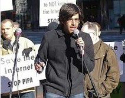

### PARTE TERZA

**Open access e cultura libera**

Documenti e materiali utili per saperne di più su questi temi centrali per
l’impegno di Aaron (e di tutti noi)

* * * * *

### Cos’è l’open access

Andrea Zanni, ripreso dal
[suo blog](http://aubreymcfato.com/2013/01/14/che-cose-lopen-access/),
aggiornamento del 06/01/2014.

L’open access è un movimento che vuole dare accesso aperto alla conoscenza, e
nello specifico alla letteratura scientifica. Sono tanti i nomi che si danno a
questi “movimenti dell’open” (open knowledge, open science, open data), e in
generale tutti vogliono più apertura e trasparenza, declinate in ambiti
specifici (ad esempio pubbliche amministrazioni, università, dati
scientifici). L’open access si focalizza su un sistema molto particolare, che
è appunto il mondo della letteratura scientifica e accademica: un mondo fatto
prevalentemente di ricercatori, che studiano, ricercano e pubblicano i propri
risultati in articoli scientifici, in riviste del proprio settore.

Le varie riviste hanno reputazioni molto diverse: ci sono quelle autorevoli e
quelle meno (pubblicare su Nature è diverso che pubblicare su Focus, ecco).
Questo perché ogni articolo, nel mondo scientifico e accademico, deve passare
attraverso il filtro della peer review, la revisione dei propri pari:
(teoricamente) gli scienziati si valutano a vicenda, controllano i risultati,
fanno le pulci alle metodologie. Ciò che passa rimane, si aggiunge al corpus
scientifico, crea il trampolino da cui poi partono gli altri. Insomma, si
costruiscono i giganti su cui ci arrampichiamo noi nani.

Qual è il punto? Perché l’open access? Cosa non va?

Be’, il punto è noioso. Il punto è che il nostro modo attuale di pubblicare la
ricerca ha molti problemi, soprattutto economici. Le riviste sono in mano a
pochissimi editori, che tengono i prezzi alti con altissimi margini di
profitto. A poter accedere agli articoli sono dunque gli
studenti/dottorandi/ricercatori delle università (più o meno ricche), perché
sono le università, tramite le loro biblioteche, a comprare gli abbonamenti a
quelle riviste. Se sei fuori dall’università, per un singolo articolo (un PDF
di 20 pagine che potrebbe anche rivelarsi non utile alla tua ricerca) puoi
pagare anche 30 euro (a PDF) – (rileggi, 30 euro a PDF).

Sono decenni che si tagliano i fondi alle biblioteche mentre sono decenni che
il prezzo delle riviste continua ad aumentare. La questione è davvero seria,
perché alcune biblioteche (parliamo anche di Harvard, non dell’Università di
Camerino) dicono che non riusciranno per molto a garantire questi abbonamenti
(che costano di centinaia di migliaia di euro), quindi i loro studenti non
avranno accesso alla ricerca scientifica prodotta nel mondo, quindi non
riusciranno a lavorare e fare ricerca loro stessi. Il nano senza gigante non
sa dove arrampicarsi e non vede nulla. Questa situazione va avanti da anni e
tutti sono concordi nell’affermare che il problema esiste davvero.

Cosa propone allora l’open access?

L’open access vuole essere la soluzione a questo problema, e propone una
rivoluzione sostanziale con due strategie principali:

– pubblicare i propri articoli e risultati in appositi archivi aperti: questa
viene chiamata via verde;

– creare apposite riviste peer reviewed ad accesso aperto: questa viene
chiamata via d’oro.

Gli archivi dove pubblicare i propri articoli e risultati possono essere
istituzionali (cioè facenti capo ad un’istituzione, come un’università) o
tematici (afferenti a un determinato settore, come per esempio
[arXiv](http://arxiv.org/) lo è per la fisica). Le riviste open access invece
seguono il sistema tradizionale di pubblicazione e revisione fra pari, solo
che poi rilasciano i loro articoli gratuitamente, per tutti. Cioè invece che
pubblicare e far leggere i propri articoli soltanto a studenti di
un’università che ha pagato l’abbonamento, sono semplici siti web che
permettono a chiunque di leggere e scaricare il PDF.

Fare una rivista costa, ma ci sono modelli di business diversi che si stanno
affermando, e quindi non è necessario far pagare al lettore (che è quello che
succede con il modello tradizionale: in Italia, gli abbonamenti vengono pagati
dalle biblioteche, cioè dalle Università, cioè con le tasse).

Queste strategie puntano a ribaltare il sistema corrente, assumendo
implicitamente un postulato fondamentale: la letteratura scientifica (cioè la
ricerca, cioè la scienza, cioè la conoscenza) è un commons, un bene comune.
Non puoi mettere dei paletti alla conoscenza, l’informazione (soprattutto
quella accademica e scientifica, filtrata e valutata, pagata coi soldi
pubblici) deve essere libera, perché se è libera è meglio, per tutti.

Ed essendo la conoscenza libera è giusto che venga trattata in maniera
diversa, perché questa è una “economia dell’abbondanza”, non della scarsità: è
importante quindi che i modelli economici siano diversi, perché nessuno si
sognerebbe di trattare allo stesso modo risorse diverse come l’educazione e il
petrolio. Che è invece quello che stiamo facendo.

Il sistema è malato in vari punti e a vari livelli (economico, etico,
sociale), la questione è complessa, davvero c’è una letteratura sterminata, là
fuori, su questo. Ci sono ottime ragioni per tentare di cambiare il sistema
corrente. E ce la possiamo fare.

Davvero? E perché?

Perché quello della letteratura scientifica è un settore particolare. Perché,
riconoscendo che la scienza/conoscenza è di tutti, siamo d’accordo sui valori:
e allora è, solo, un discorso di modelli economici. Non è moltissimo, ma è più
di quanto sembri.

E c’è più di un punto fondamentale:

1.  i soldi, in questo sistema, vengono usati solo per pagare la ricerca, gli
    stipendi e per comprare gli abbonamenti delle riviste. I ricercatori non
    vengono pagati per pubblicare (cioè, si, ma figura nello stipendio), né
    per fare la revisione dei colleghi. Sono cose che fanno gratuitamente,
    perché fa parte del loro lavoro, di come migliorano la propria reputazione
    accademica.
2.  gli “attori economici” della “filiera produttiva” della ricerca sono
    sempre gli stessi, e cioè i ricercatori:

- sono i ricercatori che scrivono gli articoli, che fanno ricerca. E’ la loro
  funzione e sono pagati dall’università (cioè dalle tasse, cioè da noi)

- sono i ricercatori che si fanno peer review a vicenda, cioè valutano e
  filtrano la ricerca scientifica degli altri, e lo fanno gratis

- sono i ricercatori l’utente finale della ricerca: sono loro a leggerla e
  studiarla, quindi loro a comprarla (con i soldi delle biblioteche, cioè
  dell’università, cioè delle tasse, cioè da noi).

I ricercatori, dunque, sono i produttori, i revisori e gli utenti finali della
ricerca scientifica.

In sostanza, la ricerca viene pagata due volte: a monte (pagando gli stipendi
ai ricercatori), e a valle (pagando le riviste su cui i ricercatori
pubblicano). Ah, i ricercatori spesso devono pagare per dover pubblicare
(anche migliaia di euro ad articolo). E danno via tutti i loro diritti (alle
case editrici). E non ci guadagnano un centesimo.

E le case editrici? Le case editrici sono un intermediario (più o meno
importante): loro fondano le riviste, le organizzano e coordinano la peer
review, impaginano, distribuiscono, vendono. Ma non producono né revisionano.
Non ne ho parlato qui sopra perché nel processo produttivo non ci sono: il
loro lavoro di coordinamento è importantissimo, ma non giustifica i loro
enormi profitti (che arrivano al 40% di margini di guadagno). Senza i
ricercatori sono meno che niente.

Scusa, ma perché i ricercatori stanno al gioco?

Intanto perché è lo status quo, ci sono abituati, è così da tempo. Poi perché
i ricercatori sanno poco e nulla di quanto paga la loro biblioteca per avere
accesso alle riviste: questo è anche un problema dei bibliotecari, e di
comunicazione. Poi c’è quella cosa del [publish or
perish:](https://en.wikipedia.org/wiki/Publish_or_perish) devono pubblicare o
morire, ne va della loro carriera accademica, le cose funzionano così. Il
ricercatore deve fare ricerca e pubblicare il più possibile, nelle riviste più
prestigiose, che ovviamente sono tutte ad accesso chiuso, araldi del sistema
tradizionale. Il cane si morde la coda.

Perché a loro, davvero, non interessa farci i soldi. A loro interessa far
“carriera”, che significa avere borse di ricerca, pagare le bollette, avere
finanziamenti per un altro anno di ricerca, magari diventare professori. E’
questa la reputazione accademica, la vera valuta all’interno del mondo
accademico.

Ricapitolando: per far carriera accademica bisogna far vedere che si vale,
cioè bisogna pubblicare tanto e bene, su riviste importanti. Le riviste
importanti sono tutte delle case editrici di cui abbiamo parlato. È il publish
or perish, pubblicare o morire. Il sistema attuale riesce così a far leva sui
giovani ricercatori, quelli che hanno più bisogno di reputazione: anche chi
vorrebbe pubblicare in open access a volte è costretto a scegliere.

Non ci credo

Lo so, non ci si crede. E non credete a me: fatevi un giro [qui, andate
su](http://wiki.openarchives.it/index.php/Pagina_principale) Wikipedia
[(quella inglese,](http://en.wikipedia.org/wiki/Open_access) o [quella in
italiano).](https://it.wikipedia.org/wiki/Open_access) E nella sezione finale
dell’ebook, trovate un utile elenco di risorse e libri di in tema.

**\*\*\***

**Dodici comandamenti per l’accesso aperto**

Maria Chiara Pievatolo, [ripreso](http://btfp.sp.unipi.it/?p=1479) dal
Bollettino Telematico di Filosofia Politica, 11/02/2012.

Come può comportarsi un ricercatore che vuole diffondere l’[accesso
aperto](http://btfp.sp.unipi.it/?qa_faqs=che-cose-la-pubblicazione-ad-accesso-
aperto) non solo a parole, ma anche nei fatti? Avevo provato a rispondere,
limitatamente [all’arte della citazione](http://btfp.sp.unipi.it/?p=212). Mi
hanno allora chiesto una guida che abbracciasse tutta l’attività di ricerca.
[Danah Boyd](http://www.zephoria.org/thoughts/) ha già [prodotto](http://www.z
ephoria.org/thoughts/archives/2008/02/06/openaccess_is_t.html) qualcosa di
simile: ecco un adattamento del suo lavoro per l’uso degli studiosi italiani.

1.  Professori ordinari o ricercatori assunti stabilmente nell’industria:
    pubblicate solo in [riviste ad accesso aperto.](http://www.doaj.org/) Non
    avete concorsi da superare. Usate il vostro privilegio per fondare riviste
    ad accesso aperto, libere dal vecchio modello economico. Aiutatele a
    costruirsi una reputazione. Fatevi una home page e metteteci i vostri
    articoli ad accesso aperto. Sarete citati molto di più, specialmente dagli
    studiosi più giovani che fanno ricerca su Google prima che in biblioteca.
    E se volete contribuire a cambiare il sistema per le generazioni future,
    non eludete le regole mettendo on-line testi ad accesso chiuso di cui
    avete [ceduto i diritti.](http://btfp.sp.unipi.it/?p=1479#diritti)
2.  Associazioni disciplinari: aiutate le riviste ad accesso aperto a
    guadagnare attrattiva. Incoraggiate i vostri membri a pubblicare su
    riviste ad accesso aperto; bandite dei premi per i migliori articoli ad
    accesso aperto e chiedete ai vostri soci che in tutti i giudizi sugli
    studiosi più giovani riconoscano loro il merito di aver pubblicato ad
    accesso aperto, anche in sedi non convenzionali. E smettete di raccontare
    che le scelte degli editori che pubblicano le vostre riviste e gli atti
    dei vostri congressi non vi riguardano. I loro profitti dipendono da voi,
    e voi a vostra volta usate il prestigio dell’editore come criterio di
    valutazione della ricerca, per costruirci e distruggerci carriere:
    [tornate a bordo, per
    favore!](https://www.youtube.com/watch?v=aDyahWDuydQ)
3.  Commissioni di concorso: riconoscete le sedi di pubblicazione alternative
    e aiutate le università a seguirvi. Gli studiosi giovani non possono
    permettersi di pubblicare in luoghi alternativi finché voi non ne
    riconoscete il valore. Promuovete questo processo e inducete le vostre
    facoltà a fare lo stesso. La meta è [quella indicata da
    Lessig](http://btfp.sp.unipi.it/?p=77): i testi ad accesso chiuso non
    contribuiscono all’uso pubblico della ragione e non possono essere
    considerati titoli scientifici validi.
4.  Giovani studiosi trasgressivi: pubblicate solo in riviste ad accesso
    aperto per protesta, specialmente se la vostra disciplina è nuova. Vi può
    costare una carriera o una cattedra – che in ogni caso non vi daranno – ma
    è la cosa giusta da fare. Se siete studiosi interdisciplinari o di un
    ambito di studi nuovo, non disponete di riviste “autorevoli”: dovete
    trovare il modo per difendervi. Potete approfittare dell’occasione per
    rendere autorevoli proprio le riviste ad accesso aperto.
5.  Giovani studiosi più conservatori: fate uscire quel che vi serve per
    vincere il concorso e, dopo aver preso servizio, smettete immediatamente
    di pubblicare in sedi ad accesso chiuso. Il vostro comportamento è
    comprensibile: ma lo diventa molto meno se persistete anche quando non vi
    serve. 5a. Se pubblicate su riviste ad accesso chiuso, controllate le
    politiche dei loro editori su [Sherpa](http://www.sherpa.ac.uk/romeo.php)
    / [Romeo](http://romeo.eprints.org/) e selezionate quelle che permettono l
    ’auto-archiviazione di una versione del vostro manoscritto su un [archivio
    aperto (via](http://minimacademica.wordpress.com/2012/01/31/una-scivolosa-
    strada-verde/) [verde).](http://minimacademica.wordpress.com/2012/01/31
    /una-scivolosa-strada-verde/) Evitate la via rossa all’accesso aperto, sia
    nella sua versione [predatoria,](http://metadata.posterous.com/83235355)
    sia in [quella](http://svpow.wordpress.com/2012/02/02/what-actually-is-
    elseviers-open-access-licence/) in apparenza più rispettabile, ma
    analogamente rapace. E prima di cedere i vostri diritti, chiedete
    consiglio al vostro bibliotecario. Probabilmente è in grado di darvi un
    parere competente o di indirizzarvi da chi lo saprà fare.
6.  Tutti gli studiosi: leggete riviste ad accesso aperto e citatele. Il
    numero di citazioni migliora la reputazione di una rivista. Se non potete
    fare a meno di citare testi ad accesso chiuso in opere ad accesso aperto,
    adottate [accorgimenti](http://btfp.sp.unipi.it/?p=212) per non aumentarne
    unilateralmente l’impatto. E citate vivi invece che morti: il giovane
    studioso di Sassari che sta estendendo un argomento di Weber ha bisogno di
    essere citato più di lui. Le citazioni hanno una politica: le vostre
    scelte sono un voto per il futuro.
7.  Tutti gli studiosi: cominciate a fare da revisori per riviste ad accesso
    aperto. Contribuite a farle prendere sul serio. Curatene dei numeri per
    migliorare la loro qualità. E lasciate perdere le riviste ad accesso
    chiuso, in modo che facciano fatica a trovare revisori di qualità.
8.  Biblioteche: abbonatevi a riviste ad accesso aperto e includetele nel
    vostro catalogo. Vi costa un po’ di lavoro in più, ma aiuta gli studiosi e
    aiuterà anche voi quando comincerete a liberarvi dalla dipendenza dalle
    riviste più care con una terapia a scalare.
9.  Università: sostenete le facoltà nella creazione di riviste ad accesso
    aperto. Usate la vostra autorevolezza per promuovere vostre riviste ad
    accesso aperto. Se ci riuscirete, miglioreranno anche la vostra
    reputazione.
10. Editori accademici: svegliatevi o levatevi di mezzo. State ostacolando gli
    studiosi e la ricerca scientifica, rendendola inaccessibile. Trovatevi un
    nuovo modello d’impresa: anche se ora ricavate profitti, i ricercatori vi
    abbandoneranno nel giro di un paio di generazioni.
11. Enti finanziatori: pretendete che i ricercatori da voi finanziati
    pubblichino in riviste ad accesso aperto o depositino i preprint in
    archivi disciplinari. Oppure finanziate direttamente le riviste per farle
    passare all’accesso aperto.
12. Prima di dire che non ci sono riviste ad accesso aperto nella vostra
    disciplina, consultate [http://www.doaj.org/.](http://www.doaj.org/) E non
    dimenticatevi degli archivi
    [(http://archives.eprints.org/](http://archives.eprints.org/) e
    [http://www.opendoar.org/).](http://www.opendoar.org/) 12b. Archiviate
    tutto sempre!

\*\*\*

#### Accesso aperto ai dati scientifici – Comunicazioni e raccomandazioni

[Documento](http://europa.eu/rapid/press-release_MEMO-12-565_en.htm) della
Commissione Europea, 17/07/2012. Traduzione di Valentina Tosi.

Cos’è l’accesso aperto?

All’interno di una politica di Open Access, i ricercatori e altri esperti
pubblicano i risultati delle loro ricerche (testi vari e/o dati, per esempio
di esperimenti) su Internet in modo che tutti possano consultare e scaricare i
risultati liberamente e gratuitamente. Open Access significa che i ricercatori
avranno un miglior accesso agli articoli e ai dati risultanti da ricerche
realizzate grazie a fondi pubblici, indipendentemente da quale istituto abbia
finanziato la ricerca.

Quali saranno i punti di forza per la proposta operativa dell’Open Access?

Spesso le pubblicazioni scientifiche sono troppo costose per essere
accessibili a tutti gli individui e le organizzazioni. Piccole imprese e
professionisti quali medici, farmacisti, ingegneri o architetti non hanno
accesso a informazioni fondamentali – nonostante abbiano pagato, tramite le
tasse, per garantire la pubblicazione dei risultati delle ricerche. Ciò
danneggia l’economia riducendo i livelli d’innovazione e competenza. In
termini scientifici, il fatto che i dati spesso non vengano condivisi da
tutti, comporta il rischio che si perda ingegno, tempo e denaro. E una
maggiore trasparenza dei dati aiuterà a evitare eventuali frodi accademiche.

Quali sono i vantaggi dell’Open Access?

Per la scienza: la ricerca scientifica e l’innovazione sono molto più
efficienti e produttive quando i ricercatori hanno un accesso più ampio e
semplice all’informazione. Non perdono tempo e denaro cercando articoli
specifici, ed è assai meno probabile che arrivino a vicoli ciechi o ripetano
lavori già compiuti. Per l’economia: un più ampio e migliore utilizzo di
informazioni complesse e dati grezzi può aiutare a creare nuove imprese e
posti di lavoro. L’esempio più noto è l’apertura dei dati nel Progetto Genoma
(HUGO) nel 2003. Entro il 2010, per ogni dollaro investito inizialmente da
fondi federali statunitensi nella ricerca HUGO è stato calcolato abbia
generato 141 dollari di attività economica. Un investimento iniziale di
ricerca pari a circa 3 miliardi di euro ha già generato circa 500.000.000.000
di euro in attività economiche…

Chi trae vantaggi dall’Open Access?

Innanzitutto, i ricercatori possono rivelarsi più produttivi, e il loro lavoro
può essere consultato e utilizzato con maggior frequenza. Studi economici
hanno dimostrato che un sistema di accesso aperto per la diffusione dei dati
della ricerca risulterebbe più conveniente sia per i [vari Paesi](http://www
.knowledge-exchange.info/Default.aspx?ID=316) che per i [singoli
istituti](http://eprints.soton.ac.uk/268584/). Questi studi rivelano inoltre
che l’Open Access sarebbe vantaggioso anche per le PMI, il [settore
pubblico](http://ie-repository.jisc.ac.uk/575/), le organizzazioni di
volontariato e di beneficenza. Per esempio, un sondaggio del governo danese ha
dimostrato che le difficoltà di accesso comportano ritardi nello sviluppo del
prodotto, e costano annualmente 73.000.000 di euro all’economia nazionale.
Ultimo vantaggio, ma di certo non il meno importante, i cittadini avranno
libero accesso alla ricerca finanziata con fondi pubblici, oltre a beneficiare
degli effetti positivi già derivati dagli altri canali.

Perché serve un intervento europeo in quest’ambito?

La scienza è un impegno globale. La grande ricerca comprende molti ricercatori
che lavorano oltre i confini nazionali. Questo lavoro dovrebbe avvenire nella
maniera più coordinata possibile, in modo che i ricercatori possano
concentrarsi sul risultato della ricerca piuttosto che sulla burocrazia o sul
sostentamento delle spese. La Commissione Europea attua il maggior programma
di finanziamento della ricerca in Europa (54.000.000.000 di euro per il
periodo 2007-2013 nell’ambito del Settimo programma quadro) e quindi agisce
anche come un finanziatore della ricerca.

Qual è l’attuale livello di Open Access in ambito scientifico?

Finora il 20% della letteratura scientifica è liberamente accessibile, il 12%
tramite archivi aperti (modello verde) e circa l’8% disponibile tramite
riviste ad accesso aperto (modello oro), come descritto sotto.

Qual è la differenza tra i modelli di accesso aperto GOLD (oro) e GREEN
(verde)?

Nel modello GOLD (pubblicazione ad accesso aperto), il pagamento delle spese
di pubblicazione è sostenuto dagli abbonamenti dei lettori (di solito la
biblioteca accademica) per l’autore di un articolo. Molto spesso questi costi
sono a carico dell’università, dell’istituto di ricerca o dell’agenzia di
finanziamento che sostiene la ricerca. Nel modello GREEN di accesso aperto
(auto-archiviazione), una versione di questo articolo (per esempio l’ultimo
articolo pubblicato o la versione finale del manoscritto, spesso chiamata
“stage versione II”) viene archiviata dai ricercatori in una piattaforma
online, prima di, dopo o nello stesso momento in cui la pubblicazione arriva
alla rivista. L’accesso all’articolo depositato viene spesso ritardato (il
“periodo d’embargo”) su richiesta degli editori per conservare i privilegi
degli abbonati. Archivi di questo tipo sono presenti nelle istituzioni
accademiche o anche organizzati secondo [discipline
specifiche.](http://roarmap.eprints.org/) Le versioni archiviate in GREEN
saranno mancanti dei ritocchi finali o dei numeri di pagina che le rendono
citabili così solo in versione stampata – incentivando così chi può pagare per
l’accesso completo. Il modello GREEN permette quindi la lettura facile ed
economica del materiale esistente pubblicato, senza danneggiare gli editori.

Cos’ha fatto finora l’UE nel settore?

L’attuale progetto di ricerca e sviluppo del Settimo programma quadro
finanziato dall’UE include un programma pilota di Open Access relativo a 1084
progetti [(FP7).](http://cordis.europa.eu/fp7/home_en.html) Qui sono
disponibili 10.000 articoli liberamente consultabili, a fronte dei 17.000 che
saranno disponibili nei prossimi mesi. Tale programma pilota comprende
ricerche provenienti da sette aree tematiche, tra cui salute, energia e
ambiente, ed è finanziato dall’infrastruttura
[OpenAire](http://www.openaire.eu/), che fornisce un unico punto d’accesso
alle pubblicazioni di ricerca finanziate dall’UE.

Come vedono l’Open Access i ricercatori?

Una [consultazione pubblica](http://ec.europa.eu/research/science-
society/document_library/pdf_06/survey-on-scientific-information-digital-
age_en.pdf) sull’argomento ha mostrato il vasto sostegno a supporto dei
principi dell’Open Access finanziato con fondi pubblici. In un sondaggio della
Commissione europea di 811 progetti coinvolti nel programma pilota, la maggior
parte degli intervistati ha espresso pieno sostegno all’accesso aperto ai dati
per la ricerca. Più in generale, nel 2007, nel giro di appena tre settimane,
18.500 scienziati e bibliotecari hanno firmato una petizione diretta alla
Commissione europea chiedendo una politica di accesso aperto, dopo la quale
sono partiti i programmi pilota. Un sostegno confermato nel giugno 2012 quando
25.000 cittadini hanno firmato una petizione diretta alla Casa Bianca per
chiedere iniziative del governo federale Usa basate sull’accesso aperto. I
docenti più qualificati sostengono gli sforzi per ampliare l’accesso alla
scienza con modelli di accesso aperto, come confermano queste [interviste in
video.](http://www.youtube.com/watch?v=94CtpXuuq5Y&feature=youtu.be)

Perché avete scelto un periodo di “embargo” di sei mesi per la ricerca nelle
“scienze dure”?

Si tratta di un approccio comune tra chi adotta l’accesso aperto, inclusi i
progetti del Settimo accordo quadro della Commissione europea attivi dal 2008.
Nel Regno Unito il Wellcome Trust permette un periodo di embargo di 6 mesi, ed
è il caso anche del Consiglio europeo della ricerca e del Consiglio della
ricerca del Regno Unito. Nel giugno 2012 anche i Consigli della ricerca in
Danimarca hanno annunciato 6 mesi come periodo di embargo.

Perché le scienze sociali e umanistiche hanno 12 mesi di embargo?

Perché occorre un arco di tempo maggiore per recuperare i costi legati a
pubblicazioni su scienze umane e sociali, rispetto alle discipline
scientifiche, tecniche e mediche. Quest’approccio rispecchia l’attuale
programma pilota ad accesso aperto della Commissione, come anche le politiche
operative degli altri enti finanziatori.

Cosa significa questo per l’occupazione in generale?

Una spinta diretta di 1.800.000.000 euro all’anno, ma non ci sono dati precisi
riguardanti i nuovi posti di lavoro. Né ci sono prove che le pratiche di
accesso aperto adottate oggi porteranno in futuro alla perdita di posti di
lavoro nel settore editoriale.

Perché il contribuente europeo dovrebbe pagare per l’accesso aperto quando
anche i Paesi terzi beneficiano del materiale?

Gli studi dimostrano che i 2/3 dei benefici economici di una politica di
accesso aperto si concretizzano nel Paese che ha finanziato la ricerca.

Come si può esser sicuri che i dati commercialmente sensibili o personali
verranno rilasciati con l’obbligo di accesso aperto ai dati?

Tutti i ricercatori devono già rispettare le norme europee sulla tutela dei
dati. La nuova direttiva rispetta anche i legittimi interessi commerciali,
compresa la necessità di tutelare preventivamente gli obiettivi raggiunti
dalla ricerca. Il quadro giuridico in questo senso rimane invariato. Tutti gli
obblighi sui dati aperti saranno dettagliati nella convenzione di sovvenzione
di ciascun progetto.

L'obbligo di conservare i dati impone degli obblighi supplementari ai
ricercatori?

La Commissione collaborerà con gli Stati membri per aiutare i ricercatori a
rispettare gli obblighi di conservazione dei dati. Questo sarà un
miglioramento rispetto alla situazione attuale in cui molti ricercatori
gestiscono da soli gli obblighi di condividere e conservare i dati in modo
corretto.

Perché l’accesso walk-in tramite una biblioteca di pubblica lettura non può
essere la soluzione per chi vuole leggere pubblicazioni scientifiche su
riviste in abbonamento?

I diritti di accesso walk-in sono una soluzione utile per alcuni gruppi, in
particolare i singoli lettori, tuttavia i limiti imposti dall’orario di
apertura e dalle barriere geografiche dimostrano che si tratta di una
soluzione inadatta. È invece grazie a Internet che si permette davvero un
accesso 24/7 a chiunque ne abbia bisogno, compresi coloro che hanno necessità
di utilizzare nuovi software e nuovi metodi scientifici digitali per condurre
revisioni automatizzate di grandi quantità di dati e pubblicazioni.
