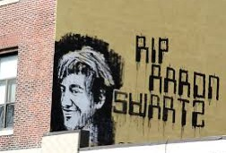

* * * * *

<!---Below is a blockquote -->
> Think deeply about things.
>
> Don't just go along because that's the way things are or that's what your
> friends say.
>
> Consider the effects, consider the alternatives, but most importantly,
> just think.
>
> – A. S.

* * * * *

### PREFAZIONE

#### Per un impegno civile senza soste né frontiere

«La [#NHRebellion](https://twitter.com/nhrebellion) Walk partirà nel giorno del
primo anniversario dalla scomparsa di
[Aaron Swartz](https://it.wikipedia.org/wiki/Aaron_Swartz) — uno dei più
convinti attivisti anti-corruzione della sua generazione — e si concluderà nel
giorno in cui è nata Granny D, attraversando lo Stato del New Hampshire per
conquistare il maggior numero di cittadini possibile alla sua causa. 

E poi chiederemo a ciascuno di loro di porre ai prossimi candidati alla
Presidenza Usa del 2016 una semplice domanda: Come pensa di porre fine a questa
corruzione?».

Così l'annuncio a fine 2013 per l'iniziativa lanciata dal Prof. Lawrence
Lessig: [una marcia collettiva di 185 miglia](http://www.nhrebellion.org/)
(quasi 300 kilometri) attraverso lo Stato del New Hampshire per riportare
all'attenzione pubblica l'irrisolto problema della corruzione a livello
istituzionale. Il [relativo wiki](http://wiki.lessig.org/Prep_here) va
raccogliendo informazioni di ogni tipo per prepararsi adeguatamente alla
camminata, che muoverà sabato 11 gennaio 2014, primo anniversario della morte
di Aaron Swartz, e si concluderà il 24 gennaio, anniversario della nascita di
Doris Haddock, meglio nota come [Granny D, scomparsa nel
marzo](https://en.wikipedia.org/wiki/Doris_Haddock) 2010 a 100 anni.

L'evento vuole emulare proprio la lunga marcia di quest'ultima, quando il
primo gennaio 1999, all'età di 88 anni, si mise in cammino per circa 3.200
miglia (oltre 5.100 km), da Los Angeles a Washington, D.C., dove giunse il 29
febbraio 2000, con un semplice cartello appeso al collo: Campaign Finance
Reform (riforma dei finanziamenti per la campagna presidenziale).
L'accostamento tra questi due attivisti (e le date prescelte) rivelano
l'urgenza e la centralità della battaglia anti-corruzione nell'odierno
contesto politico Usa, come chiariscono i promotori dell'iniziativa: «Grazie a
Granny D e ad Aaron Swartz, tutti noi abbiamo capito una cosa: la riforma sarà
possibile soltanto quando i candidati si renderanno conto che la loro vittoria
dipende dalla risposta giusta che sapranno dare».

D'altronde questa battaglia non è altro che uno dei tanti tasselli del puzzle
democratico dell'era contemporanea, quel percorso per l'affermazione della
giustizia e dell'uguaglianza sociale che animava ogni pensiero e ogni azione di
Aaron. Il quale, vale la pena di ribadirlo, non era (o non era soltanto) un
hacker, né un computer geek, nel senso stretto del termine, quanto piuttosto un
attivista sociale intenzionato a dare tutto se stesso nell'impegno costante per
quel che riteneva giusto. In perfetta sintonia con la tradizione statunitense
delle lotte a sostegno dei diritti civili nell'era moderna, calcando le orme di
figure come
[Martin Luther King Jr.](https://it.wikipedia.org/wiki/Martin_Luther_King),
[Rosa Parks](https://it.wikipedia.org/wiki/Rosa_Parks) oppure Granny D, appunto.

Portando avanti quest'impegno in prima persona e fino in fondo, applicando
precise quanto dovute azioni di disobbedienza civile e comunque all'interno di
un movimento sociale più ampio. Con l'aggiunta obbligata, nel caso di Aaron, del
ricorso alla tecnologia e agli strumenti di Internet dei nostri giorni – dandosi
continuamente da fare per crearne di nuovi e più adatti ad ampliare la
partecipazione e rendere sempre più efficace l'azione dei cittadini.

È proprio il filo rosso dell'impegno sociale a tutto tondo e senza frontiere
che ci premeva sottolineare nel mettere insieme questo e-book a un anno dalla
scomparsa di Aaron. Innanzitutto, un piccolo e attento contributo per
ringraziarlo e celebrarne la vita, oltre che tassello di una memoria storica
da tenere viva e presente. Ma anche uno strumento, speriamo utile, per provare
a spingerne ulteriormente il messaggio nell'ambito italiano, a volte fin
troppo relegato alla "periferia" dell'attivismo digitale globale. Con la
consapevolezza di volerne portare avanti le battaglie in maniera collettiva,
pur nel nostro piccolo.

Realizzato in maniera collaborativa con gli 
[annessi rilanci online](http://aaronswartztributo.tumblr.com/), l'e-book 
si apre con le traduzioni di alcuni suoi post e interventi sul web a partire
dal 2006, a sottolineare l'eclettismo e la vastità d'interessi, la puntigliosità
e finanche l'autocritica impietosa di Aaron. La seconda parte presenta invece
una serie di testimonianze e ricordi da parte di chi ha condiviso con lui
progetti e battaglie, sia come articoli online che direttamente in alcuni
eventi pubblici svoltisi in Usa dopo la sua morte. L'ultima sezione è dedicata
a materiali di base su open access e cultura libera, temi al centro del lavoro
di Aaron e altresì collante di un impegno sociale che interessa da vicino
tutti noi e soprattutto il futuro della conoscenza condivisa. Non manca, in
chiusura, un'ampia raccolta di link e risorse web per approfondire i vari
aspetti della questione, a seconda degli interessi individuali – tutt'altro
che esaustiva e soggetta ad essere ampliata e aggiornata da
[chiunque vorrà coinvolgersi](http://aaronswartztributo.tumblr.com/).

Un tributo e un ricordo, quindi, mirato a riconoscere e celebrare il genio e
il cuore di un grandissimo intellettuale e attivista del nostro secolo – quello
che, speriamo, sarà un futuro modello per le generazioni future di nativi 
digitali in ogni parte del pianeta.

La giustizia (la difficoltà di “fare la cosa giusta”, il labirinto dei
“dipende”, l'impossiblità di
[una giustizia totale](http://www.aaronsw.com/weblog/immoral))) è stata la
grande ossessione di Aaron, ed è beffardo rendersi conto che è stato proprio un
sistema di giustizia (un'istituzione, forse avrebbe detto lui) a costringerlo al
suicidio. Un dato di fatto su cui c'è poco da controbattere, come hanno
confermato una molteplicità di fonti e come documentano le testimonianze
raccolte qui di seguito.
 
Pur se la vicenda del “furto di documenti” resta a tutt'oggi poco chiara, se non
controversa, così come ambigua e controversa rimane la posizione da Ponzio
Pilato assunta dai dirigenti del MIT nell'intera fase del procedimento
giudiziario e ribadita dal
[rapporto-inchiesta](http://web.mit.edu/newsoffice/2013/mit-releases-swartz-report-0730.html)
stilato dal Prof. Hal Abelson lo scorso luglio.
Una "neutralità" che Bob Swartz, il padre di Aaron, non esita invece a definire
"un abdicare" nei confronti del figlio, una sorta di "complicità con l'indagine
penale". Come si legge una lunga analisi a freddo pubblicata dal
[Boston Magazine](http://www.bostonmagazine.com/news/article/2014/01/02/bob-swartz-losing-aaron/5/)
a inizio 2014, e caldamente consigliata:
«Con il suo silenzio, l'amministrazione del MIT ha tradito la propria missione».

In definitiva, insiste Lessig, la morte di Aaron è colpa di un sistema che ha
fallito, di una giustizia che si trasforma in persecuzione. Non a caso lo
stesso Aaron confidava al padre, negli ultimi giorni, di sentirsi come il
protagonista del Processo di
[Franz Kafka](https://it.wikipedia.org/wiki/Franz_Kafka)
(Josef K., che alla fine viene ammazzato). 
La sua storia è allo stesso tempo emblematica e straordinaria, e c'è un dubbio
che, fra gli altri, emerge con forza: cosa possiamo fare, se anche i migliori
fra noi rimangono schiacciati? Qual è la speranza?
 
L'unica speranza possibile, ricorda ancora Lessig nel discorso più bello e
commovente che abbia mai tenuto, è la speranza dell'amore, che per definizione
non guarda alle probabilità di successo o meno, bensì procede in avanti
all'infinito.
Se amiamo questo nostro mondo, nonostante tutto, ha senso provare a migliorarlo.
Ogni sistema umano è un'istituzione, e le istituzioni sono convenzioni, e le
convenzioni si cambiano. Anche se è dura vedere i più brillanti tra noi dover
soccombere anche per farci rammentare il livello della posta in gioco.

Aaron Swartz non era un santo né un martire, ma un ragazzo, una persona come
tante altre eppure diverso da tutti: aveva un inesorabile fuoco che gli ardeva
dentro, e che ancor'oggi continua a bruciare. Ora tocca a noi tenerlo vivo e
propagarlo.

Grazie, Aaron, di tutto.

Bernardo Parrella e Andrea Zanni, gennaio 2014

* * * * *
